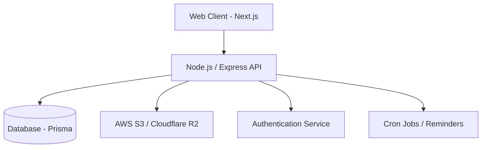

# 📦 DocuVault

DocuVault is a secure, full-stack document management system that provides robust file storage, intelligent organization, and peace-of-mind disaster recovery features. Designed for both individuals and teams, it combines a performant modern web interface with a scalable backend architecture to keep your most important documents safe and accessible.

## 🎯 Problem Statement

In an increasingly digital world, managing critical documents securely while maintaining easy access is a challenge. Traditional cloud storage often lacks specialized organization, proactive reminder features, and transparent cost monitoring for heavy users. DocuVault solves this by offering a dedicated, secure vault tailored specifically for document lifecycle management.

## 🏗 Architecture Diagram

## 🛠 Tech Stack

- **Frontend:** Next.js, React, Tailwind CSS
- **Backend:** Node.js, Express, Prisma ORM
- **Database:** PostgreSQL (or appropriate SQL DB)
- **Storage:** AWS S3 / Cloudflare R2
- **Authentication:** Custom JWT / Session based

## 🚀 Features

- **Secure document storage**: Robust cloud storage using AWS S3 / R2
- **Authentication & authorization**: Secure user access and role management
- **Reminder system**: Automated timely notifications for expiring or important documents
- **Cost monitoring**: Built-in tracking for storage costs and usage
- **Disaster recovery support**: Automated backups and data redundancy strategies

## 📸 Screenshots

Visual proof of the UI and user experience improvements.

### Dashboard (Light Mode)
| Before | After |
|--------|-------|
|  |  |

### Dashboard (Dark Mode)
| Before | After |
|--------|-------|
|  |  |

### Key UI Components
| Document Cards (Close-up) | Mobile Responsive View |
|---------------------------|------------------------|
|  |  |

> **Note:** Screenshots should be placed in the `docs/screenshots/` directory.

## 🌍 Live Demo

- **Frontend Application:** [Deploying to Vercel...](https://vercel.com)
- **Backend API:** [Deploying to Railway...](https://railway.app)